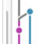

###  目录列表
* [fork代码，同步原作者更新](#fork代码，同步原作者更新)  
* [合并冲突](#合并冲突)  
* [Git fetch和git pull的区别](#fetch和pull的区别)  
* [如何看懂git的graph图](#如何看懂git的graph图)
* [远程仓库版本回退方法](#远程仓库版本回退方法)

###  fork代码，同步原作者更新 
#### 给fork加一个remote
* 使用git remote -v 查看远程状态  
`$ git remote -v`  
> _origin  https://github.com/sheshue/dreamgo.git (fetch)_  
> _origin  https://github.com/sheshue/dreamgo.git (push)_  
* 把原作者的远程仓库添加到remote  
`$ git remote add upstream https://github.com/go-chinese-site/dreamgo.git`  
* 再次查看是否添加成功  
`$ git remote -v`  
> _origin  https://github.com/sheshue/dreamgo.git (fetch)_  
> _origin  https://github.com/sheshue/dreamgo.git (push)_  
> _upstream        https://github.com/go-chinese-site/dreamgo.git (fetch)_  
> _upstream        https://github.com/go-chinese-site/dreamgo.git (push)_   
#### 同步fork
* 上游仓库 fetch 分支和提交点，传送到本地，并会被存储在一个本地分支 upstream/master  
`$ git fetch upstream`  
* 切换到本地主分支(防止出错)  
`git checkout master`  
* 把 upstream/master 分支合并到本地 master 上，这样就完成了同步，并且不会丢掉本地修改的内容  
`$ git merge upstream/master`  
* 如果没有需要手动合并的冲突就，直接 git push origin master。直接更新到github上面的fork即可，如果出现需要手动合并的冲突，请看合并冲突。  

[目录](#目录列表)
###  合并冲突
冲突有很多种，逻辑冲突，树冲突，内容冲突等。对于内容冲突，这里采用直接修改冲突文件方法  
#### 直接修改冲突文件
* 直接编辑冲突文件，把冲突标记删掉，选择正确的代码块  
__其中：冲突标记<<<<<<< （7个<）与=======之间的内容是自己的修改，=======与>>>>>>>之间的内容是别人的修改__  
* 然后提交更改重新push即可  
`$ git add . && git commit -m "合并冲突" && git push origin master`

[目录](#目录列表)
###  Git fetch和git pull的区别
* __git fetch：是从远程获取最新版本到本地，不会自动merge__          
`$ git fetch origin master`  
`$ git log -p master..origin/master`  
`$ git merge origin/master`  
> 以上命令的含义：  
> 首先从远程的origin的master主分支下载最新的版本到origin/master分支上  
> 然后比较本地的master分支和origin/master分支的差别  
> 最后进行合并  
* __git pull：相当于是从远程获取最新版本并merge到本地__  
`$ git pull origin master`
>上述命令其实相当于git fetch 和 git merge  

__在实际使用中，git fetch更安全一些因为在merge前，我们可以查看更新情况，然后再决定是否合并__  

[目录](#目录列表)
###  如何看懂git的graph图  
首先，每条线都是一个branch(分支)，每个点都是一次commit(提交记录)。  
我们当最左边的是主干。  

* 这个表示主干上的一次历史提交内容合并进黄色的分支-- __`git merge {sha}`__  
  
* 这表示从主干上的这个点创建了一个新的分支 -- __`git checkout -b`__  
  
* 这表示在新的分支上，把主干的内容合并了进来 -- __`git merge`__  
  
* 这表示黄色分支的内容合并到了主干 -- __`git merge`__  
  

[目录](#目录列表)
###  远程仓库版本回退方法 
作者太懒，不想搬运，请参考 [梧桐那时雨 的博客](http://blog.csdn.net/fuchaosz/article/details/52170105)